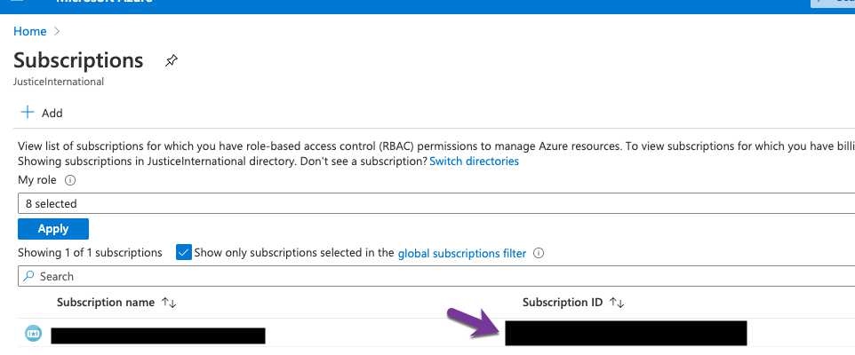
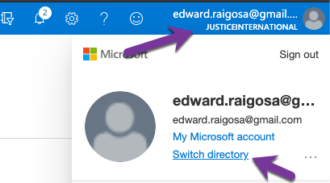
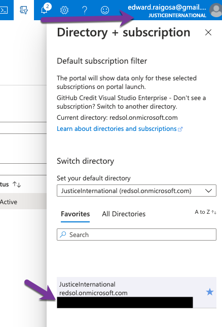
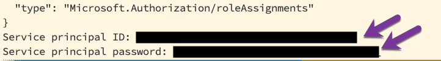

## Setting up the Azure Container Registry (ACR)

Since we're deploying with ACR, we'll need to have a service [principal](https://docs.microsoft.com/en-us/azure/container-registry/container-registry-auth-service-principal) configured after we deploy the app.

### Pre-Req
- Make sure you've deployed the app at least once, and the redsol.azurecr.io exist

### Creating the principal
- Get the `SUBSCRIPTION_ID` and `TENANT_ID` from the Az portal: https://portal.azure.com/
  - Subscription can be found in: https://portal.azure.com/#blade/Microsoft_Azure_Billing/SubscriptionsBlade
    
  - Tenant is found in the Login Information.
    
    
- Run this script to create the id : 
  ```
  SUBSCRIPTION_ID={subscription-id} TENANT_ID={tenant-id} script/bootstrap-acr.sh
  ```
- Take note of the `SP_APP_ID` (Service principal ID:) and the `SP_PASSWORD` (Service principal password:) and configure the `github/project-config` [secrets with the new](https://github.com/JusticeInternational/project-config/settings/secrets/actions) `ACR_USERNAME` with `SP_APP_ID` value and `ACR_PASSWORD` with `SP_PASSWORD` value.
  
- That's it try out a new deployment :tada: